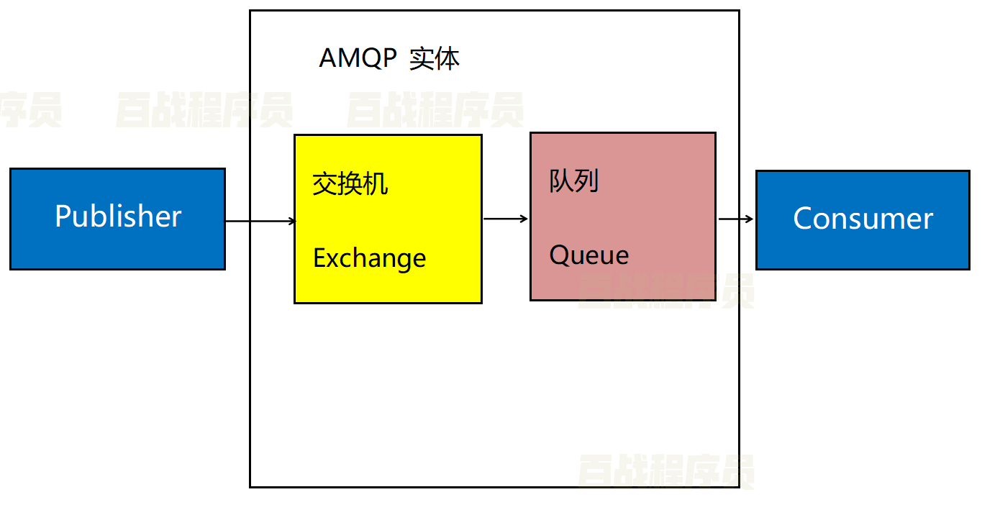

# MQ

MQ全称Message Queue（消息队列）， 是消息的传输过程中保存消息的容器，多用于系统间的异步通信。

MQ的优势是应用解耦、异步提速、削峰填谷

MQ的劣势 系统的可用性降低、系统的复杂度提高、一致性问题

MQ的业务场景是需要短时间处理大量请求，使用MQ会优先保存请求消息，不会占用系统资源，且MQ会消息排序。数据分发、数据同步、异步处理、离线处理

RabbitMQ是由Erlang语言编写的基于AMQP的MQ产品。

## AMQP

即Advanced Message Queuing Protocol(高级消息队列协议)，是一个网络协议，专门为消息中间件设计。

生产者将消息发布到交换机上，交换机更具规则将消息分发给交换机绑定的队列，队列再将消息投递给订阅了此队列的消费者。
