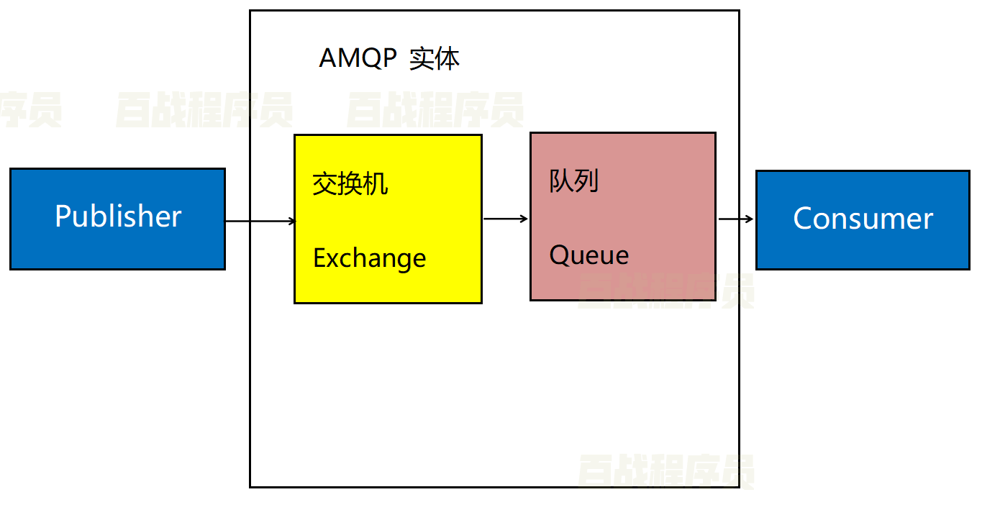

# MQ

MQ全称Message Queue（消息队列）， 是消息的传输过程中保存消息的容器，多用于系统间的异步通信。

MQ的优势是应用解耦、异步提速、削峰填谷

MQ的劣势 系统的可用性降低、系统的复杂度提高、一致性问题

MQ的业务场景是需要短时间处理大量请求，使用MQ会优先保存请求消息，不会占用系统资源，且MQ会消息排序。数据分发、数据同步、异步处理、离线处理

RabbitMQ是由Erlang语言编写的基于AMQP的MQ产品。

## AMQP

即Advanced Message Queuing Protocol(高级消息队列协议)，是一个网络协议，专门为消息中间件设计。

生产者将消息发布到交换机上，交换机更具规则将消息分发给交换机绑定的队列，队列再将消息投递给订阅了此队列的消费者。

## RabbitMQ工作原理

- Producer

  消息的生产者。也是一个向交换机发布消息的客户端应用程序。

- Connection

  连接。生产者/消费者和RabbitMQ服务器之间建立的TCP连接。

- Channel

  信道。是TCP里面的虚拟连接。例如：Connection相当于电缆，Channel相当于独立光纤束，一条TCP连接中可以创建多条信道，增加连接效率。无论是发布消息、接收消息、订阅队列都是通过信道完成的。

- Broker

  消息队列服务器实体。即RabbitMQ服务器

- Virtual host

  虚拟主机。出于多租户和安全因素设计的，把AMQP的基本组件划分到一个虚拟的分组中。每个host本质上就是一个mini版的RabbitMQ服务器，拥有自己的队列、交换机、绑定和权限机制。当多个不同的用户使用同一个RabbitMQ服务器时，可以划分出多个虚拟主机。RabbitMQ默认的虚拟主机路径是`/`

- Exchange

  交换机。用来接收生产者发送的消息，并根据分发规则，将这些消息分发给服务器中的队列中。不同的交换机有不同的分发规则。

- Queue

  消息队列。用来保存消息直到发送给消费者。它是消息的容器，也是消息的终点。消息一直在队列里面，等待消费者链接到这个队列将其取走。

- Binding

  消息队列和交换机之间的虚拟连接，绑定中包含路由规则，绑定信息保存到交换机的路由表中，作为消息的分发依据。

- Consumer

  消息的消费者。表示一个从消息队列中取得消息的客户端应用程序。
